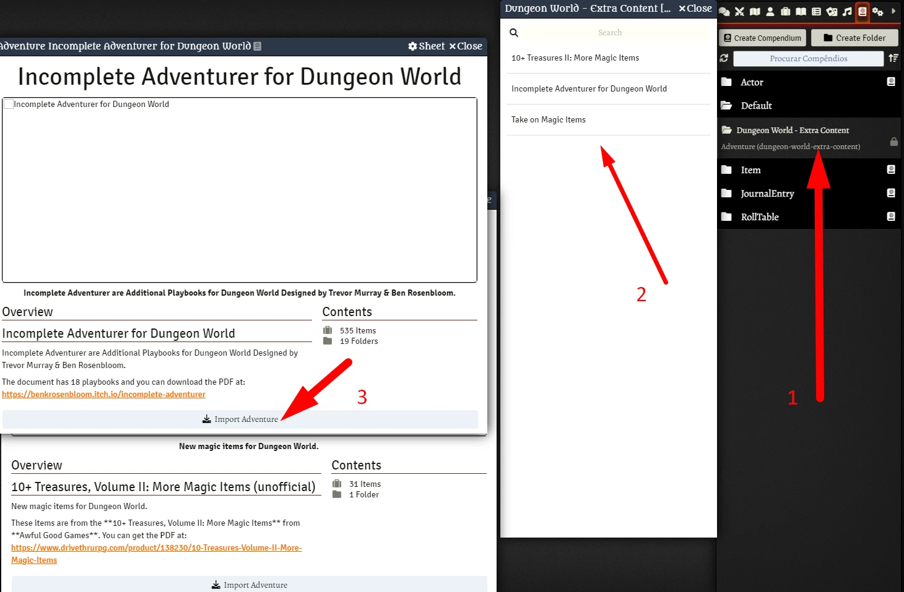

# Dungeon World - Extra Content
This module has extra content for Dungeon World.

  

## 10+ Treasures, Volume II: More Magic Items (unofficial)

New magic items for Dungeon World. 

These items are from the **10+ Treasures, Volume II: More Magic Items** from **Awful Good Games**. You can get the PDF at: https://www.drivethrurpg.com/product/138230/10-Treasures-Volume-II-More-Magic-Items

## Incomplete Adventurer for Dungeon World
Incomplete Adventurer are Additional Playbooks for Dungeon World Designed by Trevor Murray & Ben Rosenbloom.

The document has 18 playbooks and you can download the PDF at: https://benkrosenbloom.itch.io/incomplete-adventurer

### What is available?

#### Playbooks
1. The Alchemist
2. The Berserker
3. The Gunslinger
4. The Merchant
5. The Monk 
6. The Necromancer
7. The Olympian
8. The Oracle
9. The Paragon
10. The Psion
11. The Runepriest
12. The Seeker
13. The Sorcerer
14. The Spellblade
15. The Summoner
16. The Turncloak
17. The Verdant
18. The Warlock

## Take on Magic Items (unofficial)

New magic items for Dungeon World. 

These items are from the **Take on Magic Items** from **Take On Rules (unofficial)**. You can get the PDF at: https://www.drivethrurpg.com/product/106849/Take-on-Magic-Items

# Instructions
1. Import an Adventure Compendium you want.

  

# Install

## Manual Instalation
1. Go to **modules** and use the link: 
Use this: https://raw.githubusercontent.com/brunocalado/dungeon-world-extra-content/main/module.json

# Changelog
You can check changes at [CHANGELOG](CHANGELOG.md)

# License

## 10+ Treasures, Volume II: More Magic Items (unofficial)
You can check the license of this at page 2 from PDF. 

> The text is free to reuse under a Creative Commons Attribution 3.0 Unported license.

These items are from the **10+ Treasures, Volume II: More Magic Items** from **Awful Good Games**. You can get the PDF at: https://www.drivethrurpg.com/product/138230/10-Treasures-Volume-II-More-Magic-Items

## Incomplete Adventurer for Dungeon World
Incomplete Adventurer are Additional Playbooks for Dungeon World Designed by Trevor Murray & Ben Rosenbloom.

The full text of Incomplete Adventurer is released under a Creative Commons Attribution license (CC-BY).

You can check it out at: https://benkrosenbloom.itch.io/incomplete-adventurer

## Take on Magic Items (unofficial)
You can check the license of this at page 9 from PDF. 

> “Take On Magic Items” by Jeremy Friesen is licensed under the Creative Commons Attribution 3.0 Unported License.

These items are from the **Take on Magic Items** from **Take On Rules (unofficial)**. You can get the PDF at: https://www.drivethrurpg.com/product/106849/Take-on-Magic-Items

